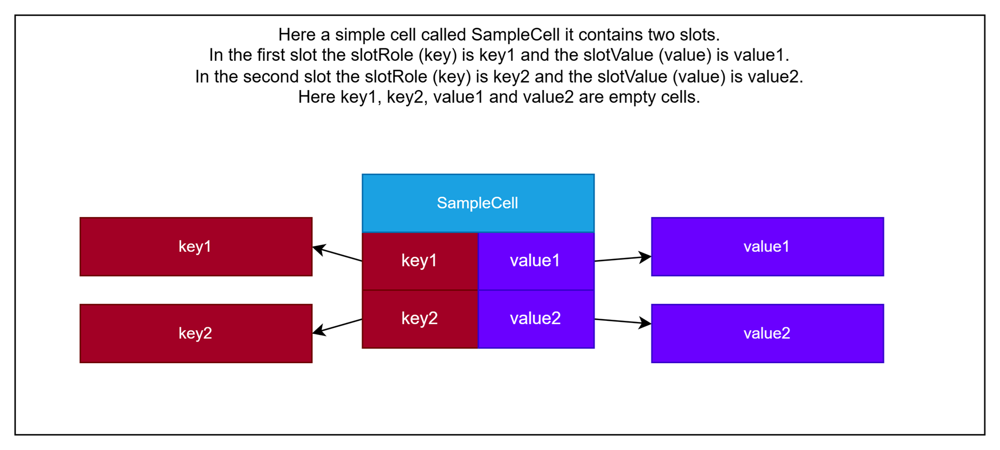

# Information-cell theory

A symbolic AI, with other words GOFAI ( good old-fashioned artificial intelligence, https://en.wikipedia.org/wiki/GOFAI) solution. The main idea presented here is a new kind of programming language that doesn't really a have syntax, mostly existing in a pure data structure form. As it doesn't have syntax so it doesn't really a programming language but a "programming material" or "programable particles". Still I call it a programming language just to avoid confusion. The language is homoiconic as it can be manipulated as data using the language ( https://en.wikipedia.org/wiki/Homoiconicity ).

The building block of this data structure is called information-cell or in short infocell. This is the only primitive type in the "language". Code and data share the same structure as in LISP. Contrary to the LISP, the main structure here is an object which conatains key-value pairs where the key and value is an object reference. We can call it an executable DSL or similar. As it doesn't have syntax we have to embed it to a host language, the reference imlementation is in C++ as it has "operator overloading" feature that we can exploit here.



Here is an example. The comment section contains a regular C++ code. The real infocell code is coming after it. The info cell code is also in C++ but it actually creates info cells in runtime.
```
    /*
    void Index::erase(CellI& role)
    {
        if (!m_type->hasSlot(role)) {
            return;
        }
        m_slots.erase(&role);
        m_type->removeSlot(role);
    }
    */
    indexStruct.addMethod("remove")
        .parameters(
            parameter("key", _(std.Cell)))
        .instructions(
            if_(not_(m_("struct")("hasSlot")("slotRole", p_("key"))))
                .then_(return_()),
            erase(self(), p_("key")),
            m_("struct")("removeSlot")("slotRole", p_("key")));
```

The great advantage of this representation is that we can easily extend the infocell language as we don't need parser for it only regular `C++` methods. We do extend the language with a new grammar mood ( see https://en.wikipedia.org/wiki/Grammatical_mood ).

One of the corner stone of this theory is that we identify regular code as "instructions". It is in a form of "imperative mood", see ( https://en.wikipedia.org/wiki/Imperative_mood ). We extend the language with an other mood called "declerative mood" or "indicative mood" or "realis mood" ( https://en.wikipedia.org/wiki/Realis_mood ) we call it "description". In this mood in human languages we indicate that something is a statement of fact. We use this section to express what change after an section of instruction executed. We can also use this section express what is the purpose of the data members in an infocell.

The mental framework for this new section "description" is that we consider instructions as tools, infotools. In regular programing languages we only issuing tool usage commands. In the description section we consider the getters functions as measurement tools where we describe what the measurement result was. In other words we describe observations. We build database from these observation. We can describe here what is the observed result of a tool usage. Later we can define the requirement or the prompt itself as an observed tool usage. I only have to describe how I verify, observe the end product. For building answer for a prompt we always ask: "What tool cause this observed effect?". We can decompose the prompt for tool usage and we can synthesize a tool that has the desired effect. We use the `measurementTool(parameters) == result` form to describe a measurement, this form is actually a math equation. And we actually solve that equation. We can extend the regular math equations with data manipulation instructions. In other word the math function are just regular infotools in this world if we define the observed effect of those infotools. 

Here is an example for a description segment:

```
    astScope.add<Struct>("Set")
        .memberOf(
            _(std.ast.Base))
        .description(
            equal(m_("cell") / m_("role"), m_("value")))
        .members(
            member("cell", "Base"),
            member("role", "Base"),
            member("value", "Base"));
```

Here we express the fact that after executing a primitive cell `Set` you can actually get the `value` from `cell.role`.

This description segment also the base for a prompt as we call it current AI systems. For example:

```
// It is true that I can get a number from an unknown cell `X` at `value` and after I add number 2 to it I get 4.
// so 2 + x = 4
Prompt:
Var& x = var_("x");
equal(add(_(_2_), _(x) / _(kb.ids.value)), _(_4_))
```
The generated answer is

```
// x = 4 - 2
set(_(x), _(kb.ids.value), subtract(_(_4_), _(_2_)))
```

You can mix any primitive cell, methode call or mathematical in the prompt, basically write a unit test and we generate a code for it. The answer generation algoritm looks similar to an LLM transformer to me I will detail this process below.


Whit the help of these description structure we can actually get a pair of description, which can represent a `before` and an `after` state, and ask: `What was changed?`. For example one description is a `before = Line(from: Point(x: 0, y: 0), to: Point(x:1, y:0)` the other one is `after = Line(from: Point(x: 0, y: 0), to: Point(x: 5, y: 0)` we can conclude that the change is `line.to.y * 5` or `line.to.y + 4`. If we have more examples we can narrow down the change to one of them. Currently this is not implemented this is the next planned feature. This process is kinda similar a backpropagation to me, I will detail the process below.

The program also conatains a primitive image recognition part whis is designed for the `ARC-AGI` challenge. It can detect `objects` which is defined as same color connected pixels. It contains a simple edge detection algorithm, ablo to detect equality, rotation, mirrorring, shrinking. Finding sub parts of the object is missing. The algorithm is implemented in C++ and also in info cells we can use this for real time image recognition even with runtime info cells. I detail the ARC-AGI and visual related things below.

## What is an infocell and how it works

### Data cells

An info cell is essentially an object just like an object from a regular OOP world. It has a unique address and can contains key-value pair of cell addresses. I call these key-value pairs as slots. Here is a simple reference implementation in C++. This is the only primitive type that can exist, no native integer or real number, nothing just this.

As we defined a slot as "if a key exist for a slot a value also present" we can say that these data cells are forming a graph as we can go from a cell to an other through the connection named `key`. To avoid confusion I usually use the `slotKey` and `slotValue` names in code for this reason.

This design is come from the fact that I wanted to able to create a refence for everything. For example in JSON you can reference items with JSONPath, or in XML with XMLPath, in an LLM you have to some n dimenson vector. Here everything has a unique address, although we can create relative path simmilar to a normal path if need such a thing.

```
class public CellI
{
    std::map<CellI*, CellI*> m_slots;
};
```

Datacells on it owns are very primitive key-value storage containers. They don't know what keys they contains. They can give back a value if you know the key. If you try to access a non-existent key it is a hard error. If you want some kind of reflection, so iterating over the keys, other cells must be involved. For this reason every cell has a dedicated slot, called `struct` which points to a describer cell which contains a list datastucture created from other cells.

Datacells are forming data structures. There is a mini standard library implemented already which contains the most popular datastructers, namely list, map, set, trie, vector, stack ... The vector structure actually emulated with maps as no low-level memory access is possible and the address of an infocell is not accessible from standard instructions. So there is no such a thing here as infocells right next to each other. In C++ we can get the address of an integer and do math calculation of it, for example subtract or add a number which correspond to the size of an integer so we can go to the previous or next integer. We have to explicitly introduce a `next` or similar slot to be able to point to an other cell, so we can connect them. This connection is one way. If cell `A` has a `next` slot to `B`, `B` doesn't know anything about this fact. So we can go from `A` to `B` through the `next` connection but can not go back. We have to introduce a `previous` or similar slot into `B` which have to point to `A` if we want two way connection.

There are "emulated" datastructures in the system those are pretending that they were created from regular infocells, but actually we just emulate them from C++ code. This is the `hybrid` namespace in the code, these kinda behave like implants. Also every input sensor is hybrid cells, for example an image sensor from C++ side is a regular std::vector but from inside the infocells looks like datastructure created from infocells.

There are some ARC-AGI challenge related cells in the hybrid namespace these are representing ARC grid and colors that can be feed with a regular ARC-AGI json file, but can be read as an infocell data structure.

### Active cells / primitive tools

There are limited operation exists in this world. Currently there are around 30 primitive operations. In my mental framework these are a the primitive tools that can form bigger, complex composite tools.

These are the following by category:

- core data handling
  - `Get` - get the value from a `cell` based on a `key`. If the key not found it is a hard error, program execution stop. The `value` slot will contains the result.
  - `Set` - set the `key` and `value` on a `cell` without any condition. If `key` doesn't exist it will create one. If `key` exists corresponding `value` will be overwritten.
  - `Has` - check that the `key` exists in a cell. The `value` slot will contains a `True` or `False` based on the check.
  - `Missing` - the negate of the `Has` operation, just for convinient
  - `Erase` - delete a slot based on `key` from a `cell` without any condition. If `key` doesn't exists in `cell` that is ok, nothing will happen.
  - `New` - create a new cell. A cell type must be given. The created cell will be in the `value` slot. Must be inserted with a `Set` to an other cell otherwise it is a leak.
  - `Delete` - deletes a cell. If cell references are found in other cells it is undefined behavior. If the host language is garbage collected then this is a no op.
  - `Same` - compare infocells based on unique address
  - `NotSame` - negate of `Same`
  - `Equal` - compare infocells based on content
  - `NotEqual` - negate of `NotEqual`

- code running / infocell activation
  - `Activate` - activates a `cell`
  - `Call` - call a function, requires a stack also and save / restore local variables on it, can be created from other cells but this is here for debug purposes
  - `Function` - start a function, but first activates the input cells, can be created from other cells but this is here for debug purposes
  - `If` - a standard if operator
  - `Do` - a standard `do` .. `while` loop
  - `While` - a standard `while` loop
  - `Block` - a standard code block, emulates a line by line execution
  - `Return` - return from a code block

- math related
  - `LessThan` - compare two number with operator `<`
  - `LessThanOrEqual` - compare two number with operator `<=`
  - `GreaterThan`- compare two number with operator `>`
  - `GreaterThanOrEqual`- compare two number with operator `>=`
  - `Add` - `+`
  - `Subtract` - `-`
  - `Multiply` - `*`
  - `Divide` - `/`

There is a clear distinction between data cells and active cells (those acts like an assembly instructions). An active cell can be activated and it can do some state hange, but a regular data cell does nothing after activation, there isn't any observabe state change after it. It is not an error if we activate (with other word execute) a data cell. It is a well defined behavior namely the cell does nothing. It acts like an insulator. The activation is very similar to executing an ASM instruction in a regular processor. Here although not a central processing unit execute the instruction but the cell itself is the mini CPU. So there is no central registers or there is no stack or instruction pointer. Every active cell responsible to track who activated it and those cells must be give back the activation. These instruction can be composed just like in a regular programming language.

We can compose these primitve tools through an activation process that looks like a monad. An active cell always get the input value from an other cell's `value` slot. When an active cell give back a result it creates/update a `value` slot inside the cell. For example an `Add` cell which add two numbers together has two input slots `lhs` and `rhs` where `lhs` is the abbreviation of "left hand side" and rhs is "right hand size". After activation a `value` slot can be accessed. So in this system we dont have a stack, every instruction has an own result register. After the `value` slot appears the activation goes back tothe cell which activated it. So every active cell has a built in intruction register (also called this register as program counter PC on some CPUs).

Accessing data members or slot values is possible with the `Get` cell. Which expects a `cell` input parameter and currently called `role`. Why not `key`? Well the code was rewritten by many times. My thought process was the following. I have to name two cells in a slot. Every slot has a uniquie role so call it `role` and every role hase a value call it then `value`. If we have a datacell called `pixel` and it has `x` role int it with a value `1`. We can get the value `1` with a `Get` instruction. `Get(cell: pixel, role: x)` after activation the `Get` instruction creates a new slot, called `value` with a valu of `1`.

### Composing primitive cells

The primitive tools is the same concept as assembler language for a processor. To be able to create more complex things we need a language for it. There is a language defined inside the infocell world which defined by datacells and not by syntax. So this language doesn't have a syntax but I actually created an ad-hoc one just to able to print out but I never tried to parse it back. The language actually consist of AST (abstract semantic tree) nodes, similar to the popular compiler clang (see https://clang.llvm.org/doxygen/classclang_1_1Decl.html or https://clang.llvm.org/doxygen/classclang_1_1Stmt.html ).

This pseudo language actually contains many C++ and Rust concepts and there is an internal compiler that can compile this language to primitive cells. This compiler is currently written in C++ but the data members are hybrid infocells. In this language we have namespace, class, method, template system and a small standard library for supporting Numbers, Strings, Lists, Maps, ...

The plan is to attach a "description" section to all composed tools to be able to use it as inspect or modify objects. For tool usage the Rust trait like system looks a better fit then a pure OOP concept. The main difference is that inheriting data members are not allowed.

## Tool usage system


# Image recognition

